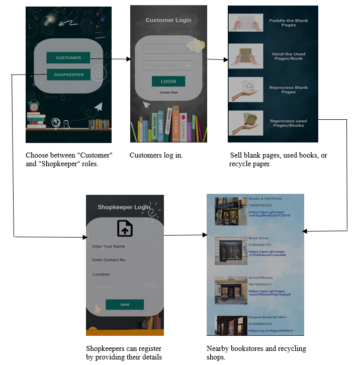

# Paper Recycling Platform

## Overview

This Android application serves as a platform to connect users with shops and shopkeepers who provide recycling services for used and unused papers. The app facilitates easy discovery, booking, and management of paper recycling services, promoting environmental sustainability by encouraging paper reuse and recycling.

## Features

### For Customers (Users)
- **User Registration & Authentication**: Secure user sign-up and login using Firebase Authentication
- **Service Selection**: Choose from four recycling services:
  - Peddle the blank pages
  - Vend the used pages/book
  - Reprocess blank pages
  - Reprocess used pages/book
- **Shop Discovery**: After selecting a service, view a list of shops and shopkeepers who provide that particular service
- **Shop Details & Contact**: View detailed information about shops including location, contact information, and ability to contact shopkeepers directly

### For Shopkeepers
- **Shopkeeper Registration & Authentication**: Secure login for shopkeepers using Firebase Authentication
- **Profile Setup**: Fill in shop details including:
  - Shop photo
  - Shop name
  - Contact number
  - Location
  - Select services provided from the four available options
- **Profile Management**: Save shop details and service offerings


## Technologies Used

- **Android Studio**: IDE for Android development
- **Java**: Primary programming language
- **XML**: For UI layouts and resources
- **Firebase**: Backend services including:
  - Authentication for user management
  - Firestore/Realtime Database for data storage
  - Storage for image uploads 

## Architecture Diagram



### Architecture Flow Explanation

1. **User Authentication**: Users authenticate via Firebase Auth
2. **Service Selection**: Users choose from the four recycling services
3. **Shop Details & Contact**: View shop information and contact shopkeepers
4. **Shopkeeper Management**: Shopkeepers set up profiles and manage services
5. **Data Persistence**: All data is stored in Firebase Firestore/Realtime Database

## Installation & Setup

### Prerequisites
- Android Studio (latest version)
- JDK 8 or higher
- Android SDK API level 21 or higher
- Firebase project setup

### Steps
1. Clone the repository:
   ```bash
   git clone <https://github.com/ritujam04/Paper_Trunk.git>
   ```

2. Open the project in Android Studio

3. Configure Firebase:
   - Create a Firebase project at [Firebase Console](https://console.firebase.google.com/)
   - Add your Android app to the Firebase project
   - Download `google-services.json` and place it in the `app/` directory
   - Enable Authentication and  Firestore in Firebase Console

4. Build and run the app on an emulator or physical device

